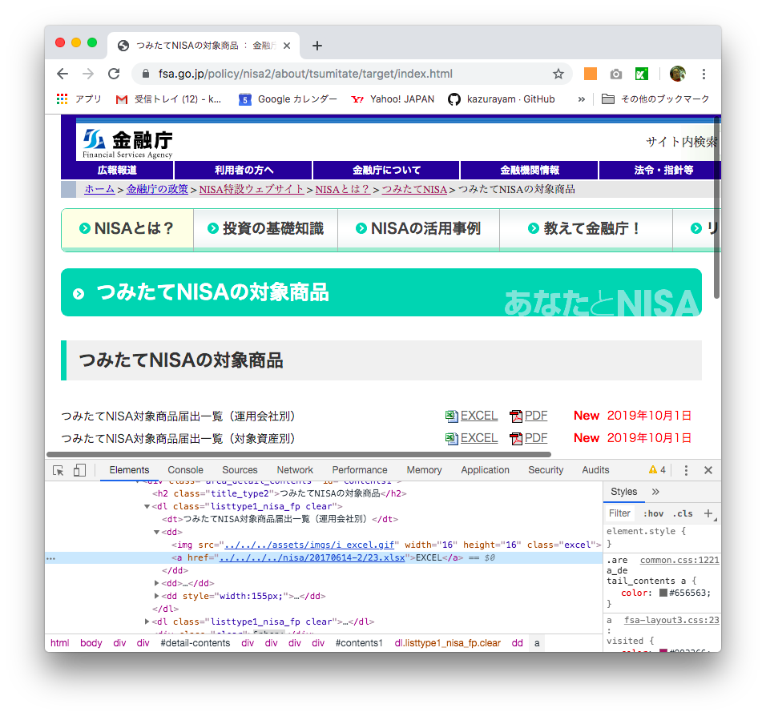
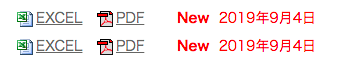
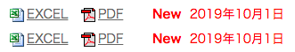

Scraping Keyword for Katalon Studio
======================================

# What is this?

This is a [Katalon Studio](https://www.katalon.com/) project for demonstration purpose.
You can download the zip from [RELEASES](https://github.com/kazurayam/ScrapingKeywordForKatalonStudio/releases) page, unzip and open it with your Katalon Studio.

This project was developed using Katalon Studio v6.3.3.

# Problem to solve: monitoring business web site and scraping materials

I want to monitor continuously [the web page](https://www.fsa.go.jp/policy/nisa2/about/tsumitate/target/index.html) of Financial Services Agency of Japan. When it is updated, I want to download PDF/Excel files from it.

This page is fairly static. It is updated atmost once per month. No push-style update  notification is provided. No schedule is published when the page will be updated next.

My business is seriously interested in the materials (the Excel files) delivered here. They need to recognize updates as soon as possible. When updated, they want to download the files and inform staffs for further business processing.

A simple approach is asking someone to manually visit the page again and again everyday hoping to find the updates. Most of the time the work falls in vain. Nobody want to do it.

So I want to automate this web site monitoring and scraping operation using Katalon Studio.

# Problem analysis

Problem.1) I want to download PDF and Excel files from the target web page to local directory

Problem.2) I want to send Emails to notify of the detected changes of the target web page

Problem.3) I want to detect that the web page has recently updated

The Problem.1 and Problem.2 are rather simple. Just I need a few custom keywords to call within my Test Cases. So I wrote them, which I will describe later.

## Detecting chronological change of web page is difficult

The Problem.3 --- how to detect a web page has been updated --- is a complexed task. Let me describe a bit more.

In September, the page looked like this:

In October, the page looked like this:

As you can see the date changed. From `2019年9月4日` to `2019年10月1日`. This is the change I mean. I need to detect this change in my solution in Katalon Studio. Is it possible?

Yes, it is possible. My [VisualTestingInKatalonStudio](https://forum.katalon.com/t/visual-testing-in-katalon-studio/13361) project offers a solution to this. Its [Chronos mode](https://github.com/kazurayam/VisualTestingInKatalonStudio#execute_chronos) enables me to store a screenshot of (part of) web page for future reference, and to bring the record back to compare the current screenshot against.

This would require a lot of work. I would do it later in another project.

# Custom keywords proposed

The Problem.1 (downloading files from web page into local) is solved by a custom keyword

- [com.kazurayam.katalon.keyword.ScrapingKeyword](Keywords/com/kazurayam/katalon/keyword/ScrapingKeyword.groovy)

The `ScrapingKeyword` uses another class which implements bytes transfer over HTTP.

- [com.kazurayam.katalon.keyword.ScrapingClient](Keywords/com/kazurayam/katalon/keyword/ScrapingClient.groovy)

The Problem.2 (sending email from Test Case script) is solved by a Groovy class

-[com.kazurayam.katalon.keyword.MailSender](Keywords/com/kazurayam/katalon/keyword/MailSender.groovy).

# Test Cases as demonstration

Please have a look at test cases as demonstration.

The following code shows how to use `com.kazurayam.katalon.keyword.ScrapingKeyword#downloadAndSave(String URL, Path dir, String filename)`

- [demo/downloadAndSaveURL](Scripts/demo/downloadAndSaveURL/fsa.go.jp_nisa2_tsumitate/Script1571704926430.groovy)

The following code shows how to use `com.kazurayam.katalon.keyword.MailSender#sendMail(...)`

- [demo/sendMail](Scripts/demo/sendMail/fromMickToKeith/Script1571710469183.groovy)
